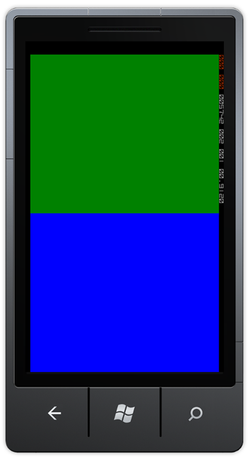
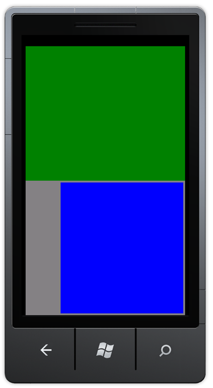

Another issue I found on StackOverflow, which is way more tricky that it seems.

Let’s say we have a Silverlight WP7 application, and we want to add a drag&drop scenario. The user first taps an element, drags his finger to another, and raises his finger on another element. Easy enough! Just handle the MouseLeftButtonDown on each element, store which element triggered the event in a property, handle the MouseLeftButtonUp on each element, and then we have the originator and the destination!

… right?

Well, so I would have thought.

Unfortunately, the MouseLeftButtonUp event will only be triggered if the ‘mouse’ left button (or your finger, sir Claus Jørgensen ;o) )1 is released on the very same control that it was pressed on.

So, if we use this XAML:

```xml
<Grid x:Name="ContentPanel" Grid.Row="1" Margin="12,0,12,0" MouseLeftButtonDown="Grid_MouseLeftButtonDown" MouseLeftButtonUp="Grid_MouseLeftButtonUp">
    <Grid.RowDefinitions>
        <RowDefinition />
        <RowDefinition />
    </Grid.RowDefinitions>
    <Grid x:Name="g1" Background="Green" MouseLeftButtonDown="Grid_MouseLeftButtonDown" MouseLeftButtonUp="Grid_MouseLeftButtonUp" Tag="dragdrop" />
    <Grid x:Name="g2" Background="Blue" Grid.Row="1" MouseLeftButtonDown="Grid_MouseLeftButtonDown" MouseLeftButtonUp="Grid_MouseLeftButtonUp" Tag="dragdrop" />
</Grid>
```

The layout looks like:

[](http://blog.wpdev.fr/wp-content/uploads/2015/08/image_1FF2BC20.png)

In the MouseLeftButtonUp event handler, we want to paint the destination grid:

```csharp
private void Grid_MouseLeftButtonUp(object sender, MouseButtonEventArgs e)
{
    var grid = (Grid)sender;

    grid.Background = new SolidColorBrush(Colors.Red);
}
```

Unfortunately, it doesn’t work. Press your finger on the upper green grid, MouseLeftButtonDown is triggered. Drag your finger to the lower blue greed, lift your finger, MouseLeftButtonUp isn’t triggered.

I already encountered a similar issue with Silverlight a few years ago, so I knew about the CaptureMouse method. What is it? Basically it tells a control to keep track of the mouse even if events are triggered outside of the control bounds. Let’s try to use it.

In the MouseLeftButtonDown, simply capture the mouse:

```csharp
private void Grid_MouseLeftButtonDown(object sender, MouseButtonEventArgs e)
{
    ((UIElement)sender).CaptureMouse();
}
```

Now the MouseLeftButtonUp event is triggered! Unfortunately, it’s triggered on the control we called CaptureMouse on, so we still don’t know on which control the finger was when released. But we have the mouse coordinates, so we should be able to find it somehow.

And that ‘somehow’ is the ‘VisualTreeHelper.FindElementsInHostCoordinates’ method. It takes a point and a control, and enumerates all the control’s child that are located at the specified coordinates. Sounds good enough.

So now let’s rewrite our MouseLeftButtonUp event handler, without forgetting to release the mouse capture:

```csharp
private void Grid_MouseLeftButtonUp(object sender, MouseButtonEventArgs e)
{
    var grid = (Grid)sender;

    grid.ReleaseMouseCapture();

    var mouseUpGrid = VisualTreeHelper.FindElementsInHostCoordinates(e.GetPosition(this), this.ContentPanel)
        .OfType<Grid>()
        .FirstOrDefault();

    if (mouseUpGrid != null)
    {
        Debug.WriteLine("MouseUp in " + mouseUpGrid.Name);
        mouseUpGrid.Background = new SolidColorBrush(Colors.Red);
    }
}
```

Test on the emulator, and… it works!

Well, sure it does, but now let’s imagine a more complex scenario:

```xml
<Grid x:Name="ContentPanel" Grid.Row="1" Margin="12,0,12,0">
    <Grid.RowDefinitions>
        <RowDefinition />
        <RowDefinition />
    </Grid.RowDefinitions>
    <Grid x:Name="g1" Background="Green" MouseLeftButtonDown="Grid_MouseLeftButtonDown" MouseLeftButtonUp="Grid_MouseLeftButtonUp" />
    <Grid x:Name="DummyGrid" Grid.Row="1" Background="Gray">
        <Grid x:Name="g2" Background="Blue" Margin="100,0,0,0" MouseLeftButtonDown="Grid_MouseLeftButtonDown" MouseLeftButtonUp="Grid_MouseLeftButtonUp" />
    </Grid>
</Grid>
```

The layout looks like:

[](http://blog.wpdev.fr/wp-content/uploads/2015/08/image_41AE6EE4.png)

We only want to be able to drag from the green grid to the blue one (and the other way around). Unfortunately, using the previous code, the drag&drop will be detected even if we lift our finger on the gray grid. So we need a way to opt-in to the drag&drop detection, rather than detect it on all the grids.

The dirty way would be to store the name of the blue and green grids, and check the name in the MouseLeftButtonDown event. But we can make something more generic using the Tag property.

What is Tag? It’s an object property available on every control. What is stored in this property? Nothing. It’s meant to be used by you, and only by you, to store whichever object you want to personalize the control.

In our XAML, let’s add the “dragdrop” string in the Tag of the green and blue grids:

```xml
<Grid x:Name="ContentPanel" Grid.Row="1" Margin="12,0,12,0">
    <Grid.RowDefinitions>
        <RowDefinition />
        <RowDefinition />
    </Grid.RowDefinitions>
    <Grid x:Name="g1" Background="Green" MouseLeftButtonDown="Grid_MouseLeftButtonDown" MouseLeftButtonUp="Grid_MouseLeftButtonUp" Tag="dragdrop" />
    <Grid x:Name="DummyGrid" Grid.Row="1" Background="Gray">
        <Grid x:Name="g2" Background="Blue" Margin="100,0,0,0" MouseLeftButtonDown="Grid_MouseLeftButtonDown" MouseLeftButtonUp="Grid_MouseLeftButtonUp" Tag="dragdrop" />
    </Grid>
</Grid>
```

Then, in the MouseLeftButtonUp event handler, it’s only a matter of filtering which controls have the appropriate tag:

```csharp
private void Grid_MouseLeftButtonUp(object sender, MouseButtonEventArgs e)
{
    var grid = (Grid)sender;

    grid.ReleaseMouseCapture();

    var mouseUpGrid = VisualTreeHelper.FindElementsInHostCoordinates(e.GetPosition(this), this.ContentPanel)
        .OfType<Grid>()
        .FirstOrDefault(element => element.Tag is string && (string)element.Tag == "dragdrop");

    if (mouseUpGrid != null)
    {
        Debug.WriteLine("MouseUp in " + mouseUpGrid.Name);
        mouseUpGrid.Background = new SolidColorBrush(Colors.Red);
    }
}
```

Now the gray grid is excluded, as expected.

And that’s how a seemingly easy problem turns out on a solution requiring the use of Tag, VisualTreeHelper.FindElementsInHostCoordinates, and CaptureMouse. Quite instructive if you ask me.

 

* * *

1: Ok, now I’m putting private jokes on my blog articles. We’re doomed.
