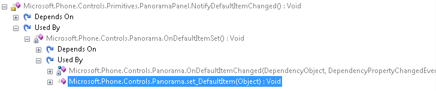

A strange issue with the Panorama control, that has been brought to my attention by [@lancewmccarthy](https://twitter.com/lancewmccarthy), and which has also been encountered [by some people on StackOverflow](http://stackoverflow.com/questions/7452526/toggling-panoramaitem-visibility-via-delegate/).

The original scenario was a bit too complex for a blog post, but we can reproduce it in a much simpler way.

Create a new page, and add a panorama control called ‘Panorama’. Then add two PanoramaItem, and put a button in the first one:

In the click event handler of the button, we toggle the visibility of the second item of the panorama:

Start the application, try tapping on the button, and the visibility of the PanoramaItem changes as expected.

Now, let’s just change the XAML to set the visibility of the second item of the panorama to ‘Collapsed’:

Start the application again, tap on the button, and… Nothing happens! What’s going on?

Diving a bit in the Panorama control source code, using good ol’ friend Reflector, we can see that the Panorama host a PanoramaPanel control. The PanoramaPanel contains most of the items placement logic, and has a ‘VisibleChildren’ property. Looks promising!

Only a handful of methods access this property, and we can quickly conclude that the ‘VisibleChildren’ collection is populated only by the \`MeasureOverride’ method. From there, we can elaborate a theory: at loading time, our panorama item isn’t visible, and therefore isn’t added to the \`VisibleChildren’ collection. Later, when we change the visibility of the PanoramaItem, the panorama’s position isn’t invalidated, so the list of visible items isn’t refreshed, and the PanoramaItem isn’t added back to the ‘VisibleChildren’ collection.

It’s easy to test, let’s just change our click event handler to force the panorama to re-compute its size:

And sure enough, it works! Now, the ‘Measure’ method expects a parameter. Giving ‘Size.Empty’ basically tells the control “Use all the space available”. While it should be ok in most case, it may have unforeseen consequences in some specific scenarios.

Unfortunately, just calling the ‘InvalidateMeasure’ method of the panorama doesn’t work. It looks like the event isn’t propagated to the child panel. And we can’t directly access the child panel because it isn’t exposed in a public property. Is there another way out?

By randomly browsing the source code of the PanoramaPanel with Reflector, we can see a ‘NotifyDefaultItemChanged’ method, which looks quite promising:

Now if we could just trigger this method, our problem would be solved. Using the ‘Analyze’ feature of Reflector, we can see that this method is called by the setter of the ‘DefaultItem’ property of the panorama:

That’s perfect! We just have to change the panorama’s default item to ensure that our PanoramaItem becomes visible as expected. Since we don’t want to disrupt the panorama, and since there’s no specific check in the property setter, we just assign back the value of the property to itself:

Now the panorama is behaving as expected, and the visibility of the PanoramaItem is correctly updated, even if the item was collapsed when the page was loaded.
