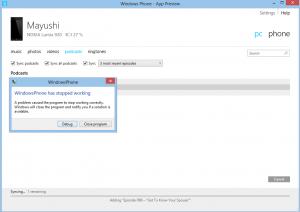
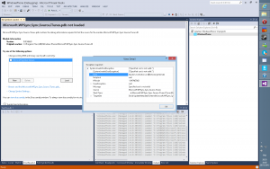
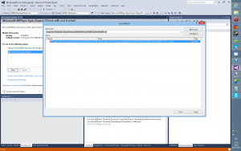

Since a few days, I had this annoying bug in the application used to sync my Windows Phone with my desktop computer: every time I tried to synchronize podcasts, the application just crashed. After a while, I decided it would be a nice debugging exercise to dig into the issue myself.

First step: reproducing the issue. It was easy enough, the app automatically crashed when clicking the “Sync button”. And sure enough, this time again, it did crash:

[](http://blog.wpdev.fr/wp-content/uploads/2015/02/12.png)

I suspected that the application was written in .NET (most Windows Phone related apps are), so I clicked on Debug and selected Visual Studio 2012. VS directly showed me that an InvalidCastException was the issue, and that the method was called in ITunesMusicSyncSource.GetLocationForReverseTransfer.

[](http://blog.wpdev.fr/wp-content/uploads/2015/02/21.png)

It’s precise enough. From there, I started Reflector, loaded the Microsoft.WPSync.Sync.Source.iTunes assembly, and navigated to the specified method:

[](http://blog.wpdev.fr/wp-content/uploads/2015/02/3.png)

At first, I couldn’t find the problem. There’s sure a few casts in there, but none of them seemed nasty at first glance. I still had my Visual Studio open, so I started manually trying each cast in the QuickWatch window until I found the wrong one:

[](http://blog.wpdev.fr/wp-content/uploads/2015/02/4.png)

Indeed, according to the signature, the “item.Properties.ObjectForKey” method returns an object. If the property is not found, the default value (passed as the second parameter) is returned. So in this case, if the ZMEDIAITEM\_ATTRIBUTE\_BOOKMARK property isn’t found, the value 0 is returned. Then, the return value is casted to long. Except that 0 is an int! A cast from int to long is valid, but we first need to unbox the value by explicitly casting it to long.

Basically:

```csharp
long l = 0L;
object obj = (object)l;
int a = (int)obj; // Invalid
int a = (int)(long)obj; // Valid
```

That’s an easy-to-make mistake, so I’m not really surprised it wasn’t detected in the released product.

Anyway, now that we know what the bug is, can we fix it? Sure. By using a Reflector add-in called ReflexIL, we can rewrite the bogus code.

[](http://blog.wpdev.fr/wp-content/uploads/2015/02/5.png)

It’s for those cases that knowing a bit of CIL can be quite useful. The “0” integer value is loaded on the stack by calling “ldc.i4.0”, then boxed to a System.Int32. We simply replace the instruction to box to a System.Int64, and add a “conv.i8” right before to convert the value to long. Then right-click on the assembly, and click on “Save as” to export the modified assembly. Since the original assembly is signed, ReflexIL asks what if we want to sign the new assembly:

[](http://blog.wpdev.fr/wp-content/uploads/2015/02/6.png)

We don’t have the signature file, so we can’t possibly re-sign it. So I’ve just selected “Register it for verification skipping (on this computer)” to allows the .NET framework to load the unsigned assembly. Since I don’t intend to publish the file, it shouldn’t be a problem.

Once the new assembly is generated, just replace the old one in the application’s folder (don’t forget to make a backup!)

Now start the application again, try to sync the podcast, and... Sure enough, it works!

[](http://blog.wpdev.fr/wp-content/uploads/2015/02/7.png)
