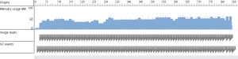
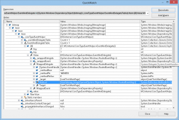

There’s a memory leak that has been bothering me for a while in my Imageboard Browser app. The scenario is simple: a slideshow feature, where a new picture is loaded from an url every few seconds. After a while, the app crashes with an OutOfMemory exception. I’ve never been able to find the source of the leak, so I settled for a dirty workaround consisting in loading a fake picture in the BitmapImage instance to force it to release the memory:

```csharp
private void DisposeImage(BitmapImage image)
{
    if (image != null)
    {
        try
        {
            using (var ms = new MemoryStream(new byte[] { 0x0 }))
            {
                image.SetSource(ms);
            }
        }
        catch (Exception)
        {
        }
    }
}
```

It fixed the issue, but I didn’t dig much further. However, over the last few weeks I’ve seen many similar leaks reported on StackOverflow, so I’ve finally decided to get to the bottom of the problem.

## Setup

To diagnose a memory issue, the first thing to do is to have a repro case. It must be as simple as possible and have no random components, to be able to focus on the issue.

First, I needed a list of pictures. I browsed the Internet a bit, found a wallpaper website with predictable urls, and set up a small program:

```csharp
public partial class MainPage : PhoneApplicationPage
{
    private int CurrentIndex = 100;

    public MainPage()
    {
        InitializeComponent();
    }

    protected override void OnNavigatedTo(System.Windows.Navigation.NavigationEventArgs e)
    {
        this.LoadNextPicture();
    }

    private void LoadNextPicture()
    {
        GC.Collect();
        GC.WaitForPendingFinalizers();
        Debug.WriteLine(Microsoft.Phone.Info.DeviceStatus.ApplicationCurrentMemoryUsage);

        Thread.Sleep(TimeSpan.FromSeconds(5));

        var bitmap = new BitmapImage();

        bitmap.ImageOpened += bitmap_ImageOpened;
        bitmap.ImageFailed += bitmap_ImageFailed;

        bitmap.UriSource = new Uri(string.Format("http://www.maximumwallhd.com/fonds-ecran/3d/abstrait/fond-ecran-3d-abstrait-{0}.jpg", this.CurrentIndex++), UriKind.Absolute);

        this.MainImage.Source = bitmap;
    }

    void bitmap_ImageFailed(object sender, ExceptionRoutedEventArgs e)
    {
        Debug.WriteLine(e.ErrorException.Message);
        this.LoadNextPicture();
    }

    void bitmap_ImageOpened(object sender, RoutedEventArgs e)
    {
        this.LoadNextPicture();
    }
}
```

Basically, it calls the garbage collector, display the total memory usage, wait a while (to avoid triggering any anti-leech protection from the website), load the picture, then back to step one. The XAML part just contains an Image control called “MainImage”.

Start the app, and sure enough we’re leaking:

[](http://blog.wpdev.fr/wp-content/uploads/2013/02/1.png)

After only nine pictures, the app crashes with an OutOfMemory exception. Good! Now let’s try to find out what’s going on.

## The workarounds

First of all, the workarounds. The two I know are : loading a dummy picture (as explained in the introduction), or setting the UriSource to null. Let’s try both.

Loading a dummy picture:

[](http://blog.wpdev.fr/wp-content/uploads/2013/02/2.png)

Setting UriSource to null:

[](http://blog.wpdev.fr/wp-content/uploads/2013/02/3.png)

The curves are really similar, in both case we’ve stopped leaking memory (at least: large amounts of memory). Now the problem is: we obviously shouldn’t have to use workarounds. Is there another way?

## Finding the cause

After a bit of trial and error, I found something that I really wasn’t expecting. Removing the ImageOpened and ImageFailed event handler fixes the leak!

By simply changing the ImageOpened method to this:

```csharp
void bitmap_ImageOpened(object sender, RoutedEventArgs e)
{
    var bitmap = (BitmapImage)sender;

    bitmap.ImageOpened -= bitmap_ImageOpened;
    bitmap.ImageFailed -= bitmap_ImageFailed;

    this.LoadNextPicture();
}
```

The memory usage is higher than when using the workaround so I let the test run longer, but it looks stable:

[](http://blog.wpdev.fr/wp-content/uploads/2013/02/4.png)

Why the increase in memory usage? We’re calling LoadNextPicture from the ImageOpened event handler. Therefore, we’re still in the picture loading callstack, and the garbage collector has nothing to clean yet when it’s called. To test this theory, I replaced the call to LoadNextPicture by “Dispatcher.BeginInvoke(() => this.LoadNextPicture());”. Also, we’re calling GC.Collect **before** setting the new image source. Thus it isn’t available yet for collection, and we actually have two pictures at the same time in memory. After adding a GC.Collect after the image source assignment, we have the same memory curve as when using the workarounds:

[](http://blog.wpdev.fr/wp-content/uploads/2013/02/5.png)

## Digging further

Now, we know that the leak occurs when not removing the ImageOpened and ImageFailed event handlers. The problem is: it shouldn’t happen.

As a quick reminder, the garbage collector works by keeping track of what is called “GC roots”. Those are references that can’t be collected: for instance, static variables. Then, the garbage collectors browses the objects referenced by those roots, and the objects referenced by those references, and so on. After recursively browsing the reference tree, all objects that weren’t found are freed from the memory.

In our case, the PhoneApplicationPage object is used by the application, and therefore won’t be freed. Therefore, when an object is referenced by the page, it won’t be freed either.

On top of that, we’ve got event handlers. Event handlers are a frequent source of memory leaks. Imagine we’re creating an object called “ChildObject”. We assign a method of this object, called “SomeMethod”, to the “Loaded” event of our page. Then, even though we’re not referencing this object any further in the code, the object is still referenced by the page (through the event handler) and will be kept alive as long as the page is alive!

Is that our problem here? No, because we’re assigning a method of our page to the ImageOpened and ImageFailed events. The BitmapImage is keeping a reference to our page, but not the other way around. So the BitmapImage is keeping the page alive, but the page shouldn’t keep the BitmapImage alive. The cause of our leak must be elsewhere.

Just to make sure, I reverted to the leaky version of the program, and created the described “ChildObject” class. It implements a finalizer, to know when it’s freed by the garbage collector, and an empty Bitmap\_ImageOpened method:

```csharp
public class ChildObject
{
    ~ChildObject()
    {
        Debug.WriteLine("Finalizer");
    }

    public void Bitmap_ImageOpened(object sender, RoutedEventArgs e)
    {
    }
}
```

Then, I assign this “Bitmap\_ImageOpened” method to the ImageOpened handler of the BitmapImage. Our LoadNextPicture method is now:

```csharp
private void LoadNextPicture()
{
    GC.Collect();
    GC.WaitForPendingFinalizers();
    Debug.WriteLine(Microsoft.Phone.Info.DeviceStatus.ApplicationCurrentMemoryUsage);

    Thread.Sleep(TimeSpan.FromSeconds(5));

    var child = new ChildObject();

    var bitmap = new BitmapImage();

    bitmap.ImageOpened += child.Bitmap_ImageOpened;

    bitmap.UriSource = new Uri(string.Format("http://www.maximumwallhd.com/fonds-ecran/3d/abstrait/fond-ecran-3d-abstrait-{0}.jpg", this.CurrentIndex++), UriKind.Absolute);

    this.MainImage.Source = bitmap;
}
```

When executing the application, the console shows:

> 5070848
> 
> 26812416
> 
> Finalizer
> 
> 37093376
> 
> Finalizer
> 
> 53968896
> 
> Finalizer
> 
> 70389760
> 
> Finalizer
> 
> 79781888
> 
> Finalizer
> 
> 96452608
> 
> Finalizer
> 
> 113881088
> 
> Finalizer
> 
> 129703936
> 
> Finalizer
> 
> 146341888

The finalizer is called. So even though we’re leaking memory, the ChildObject is freed. Which means that the BitmapImage is freed as well!

To be sure, I tried to voluntarily keep the BitmapImage alive. I’ve done so by creating a property of type “List<object>” and storing the BitmapImage instances inside. Executing the app then provides the following output:

> 4993024
> 
> 27533312
> 
> 37752832
> 
> 53293056
> 
> 70389760
> 
> 79060992
> 
> 95039488
> 
> 113156096
> 
> 129724416
> 
> 146386944

The finalizer isn’t called anymore. **We’ve proven that the BitmapImage is indeed cleaned by the garbage collector.** So what are we actually leaking? Maybe the memory profiler can tell us?

Loading the first snapshot, I tried seeing what was consuming the memory:

[](http://blog.wpdev.fr/wp-content/uploads/2013/02/6.png)

… Nothing. Which means we’re probably leaking native memory (the profiler only shows managed memory, .NET objects that is).

## One more step

There’s nothing more we can do with Visual Studio. It’s time to start Reflector and decompile the framework’s assemblies to try to understand what’s happening.

We know the leak is centered around the event handler, so we can directly go and see what’s going on there.

Nothing interesting in the code of the ImageOpened event:

```csharp
public event EventHandler<RoutedEventArgs> ImageOpened
{
    add
    {
        base.AddEventListener(DependencyProperty.RegisterCoreProperty(0x659e, null), value);
    }
    remove
    {
        base.RemoveEventListener(DependencyProperty.RegisterCoreProperty(0x659e, null), value);
    }
}
```

Removing the event handler fixes the leak, so let’s see what is in this “RemoveEventListener” method.

```csharp
internal void RemoveEventListener(DependencyProperty property, Delegate handler)
{
    this._coreTypeEventHelper.RemoveEventListener(this, property, handler);
}
```

Meh, just a wrapper. Let’s see the \_coreTypeEventHelper.RemoveEventListener method:

```csharp
internal void RemoveEventListener(IManagedPeerBase obj, DependencyProperty property, Delegate handler)
{
    foreach (KeyValuePair<int, EventAndDelegate> pair in this.EventAndDelegateTable)
    {
        if (pair.Value.Handler == handler)
        {
            CoreDependencyProperty property2 = pair.Value.Property as CoreDependencyProperty;
            if ((property2 != null) && (property is CoreDependencyProperty))
            {
                CoreDependencyProperty property3 = property as CoreDependencyProperty;
                if ((property2.m_nKnownId != property3.m_nKnownId) && !SkipEventComparisonDuringRemoveEventListener())
                {
                    continue;
                }
            }
            else if (pair.Value.Property != property)
            {
                continue;
            }
            string eventName = "M@" + pair.Key.ToString();
            XcpImports.RemoveEventListener(obj, property, eventName);
            this.EventAndDelegateTable.Remove(pair.Key);
            break;
        }
    }
}
```

The method checks a few things, then calls the XcpImports.RemoveEventListener method, and finally removes something from the “EventAndDelegateTable” dictionary. Now that’s interesting, maybe the memory is used by the dictionary?

The dictionary stores instances of an internal class called “EventAndDelegate”. It only contains a reference to the dependency property and to the delegate used as event handler (in our case: the bitmap\_ImageOpened method). Nothing big enough to explain the leak.

Then maybe the XcpImports.RemoveEventListener method?

```csharp
[SecuritySafeCritical]
internal static unsafe void RemoveEventListener(IManagedPeerBase obj, DependencyProperty property, string eventName)
{
    CheckThread();
    CValue outval = new CValue();
    outval.nType = (uint) CValueType.valueString;
    outval.m_cbData = checked((uint) eventName.Length);
    fixed (char* str = eventName)
    {
        char* chPtr = str;
        outval.m_pData = (IntPtr) chPtr;
        CheckHResult(RemoveEventListenerNative(obj.NativeObject, property.m_nKnownId, ref outval));
    }
    GC.KeepAlive(obj);
}
```

It’s getting really low-level here. But the interesting part is the line:

```csharp
CheckHResult(RemoveEventListenerNative(obj.NativeObject, property.m_nKnownId, ref outval));
```

We’re calling a method called “RemoveEventListenerNative”. As its name indicates, it’s a native method, so we can’t use Reflector to see what it’s doing. But the method receives a parameter called “obj.NativeObject”, making it a nice candidate for our leak.

Stepping back and digging into the “add” part of the event, we reach a similar AddEventListener method, passing the “obj.NativeObject” parameter to a method called “AddEventListenerNative”:

```csharp
CheckHResult(AddEventListenerNative(obj.NativeObject, property.m_nKnownId, ref outval, handledEventsToo));
```

How to know whether it’s the source of the leak or not? By calling it ourselves!

Back in Visual Studio, with the leaky version of the app. Let’s set a breakpoint in the bitmap\_ImageOpened method, then explore the BitmapImage object with the QuickWatch window:

[](http://blog.wpdev.fr/wp-content/uploads/2013/02/7.png)

Here we find our “EventAndDelegateTable” dictionary, with only one entry: our ImageOpened event handler (I removed the ImageFailed event handler to have as little noise as possible).

The XcpImports.RemoveEventListener takes three parameters: the instance of the BitmapImage class, the dependency property, and an “eventName” string. This string is the concatenation of the constant “M@” and the key of the entry in the EventAndDelegateTable table. In our case, we see in the QuickWatch window that the key is “7”. Therefore, we execute this in the “Immediate” window of Visual Studio:

> MS.Internal.XcpImports.RemoveEventListener(bitmap, DependencyProperty.RegisterCoreProperty(13409, null), "M@7");

Then we resume the code execution by pressing F5, wait for the breakpoint to be hit again, and do the whole process once more. This time, the key is “8”, looks like it’s incremented by 1 every time.

After doing that a few times, we can look at the memory usage in the Output window:

> 28971008
> 
> 37257216
> 
> 37691392
> 
> 44126208
> 
> 37838848
> 
> 38096896
> 
> 45613056
> 
> 45699072
> 
> 45240320

The memory usage stays below 50MB. When compared to the previous values, it becomes obvious that we’ve found the source of the leak.

## Conclusion

**_Up to this point, what have we found?_**

\- When assigning an event handler to a BitmapImage (ImageOpened or ImageFailed, I haven’t tested with DownloadProgress but it’s probably the same), the runtime internally keeps a reference to the picture’s native object.

\- When removing the event handler, the native object is freed as expected. If the event handler isn’t removed, the runtime keeps the reference to the native object, therefore leaking huge amounts of memory.

**This is a bug.** Our code follows the .NET guidelines, and we’ve proven that the managed instance of the BitmapImage object is released by the garbage collector. So **we’re not keeping stray references anywhere.**

 

**_What should the framework developers do?_**

It’s hard to tell, since I don’t know how the reference is used by the native code. But they should at least consider making the BitmapImage implement the IDisposeable interface, and clean the event handlers in the Dispose method. The IDisposeable interface is the .NET way to tell the developer “be extra careful or you may be leaking memory”. **In the current implementation of the BitmapImage class, there is no way to suspect that a leak will occur.**

 

**_What should third-party Windows Phone developers do?_**

When using a BitmapImage, ensure that you’re removing the event handlers in every possible code path. Use Visual Studio’s Performance Analyzer and test your code with very large pictures to make sure you’re not leaking memory. And set the UriSource of the BitmapImage to null, as an extra precaution.
