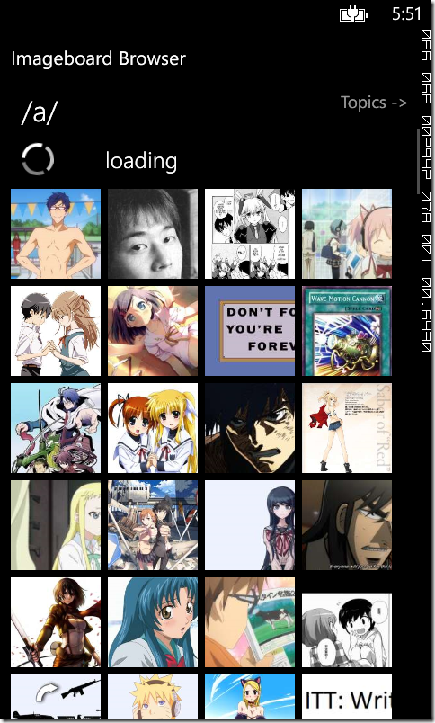

While working on a new version of my [ImageBoard Browser](http://www.windowsphone.com/s?appid=1c5fe251-d47c-4b15-b181-7d4c0ad172f9) app (warning: shameless self-placement), I decided to try and use the pull-to-refresh feature integrated to the Telerik’s RadDataBoundListBox control. The pull-to-refresh is about automatically refreshing a list when the user scrolls to its end. It’s a feature a bit lacking in terms of discoverability, and it’s therefore recommended to add a few UI hints to help the user understand he can still scroll after reaching the end of the list. However, it’s a gesture that feels great at usage, bends into the UI flow, and saves a few precious pixels of screen space.

Enabling the feature on the RadDataBoundListBox is straightforward: just set the “IsPullToRefreshEnabled” property to True, and subscribe to the “RefreshRequested” event. When the event is triggered, the control automatically display a neat loading animation. When you’re done loading the new data, simply call the “StopPullToRefreshLoading” method to stop the animation.

So far, so good. The feature works flawlessly, and I was about to call it a day. That’s when I noticed a major flaw: when the list is empty (either because the query yielded no result, or because of a network error), the pull-to-refresh feature doesn’t work. Apparently, [Telerik is aware of that behavior](http://www.telerik.com/community/forums/windows-phone/databound-listbox/emptycontent-with-pulltorefresh.aspx). Maybe it will be changed in an upcoming version, but for now, how to work around this issue?

The objective is to allow the user to refresh the list when there is no element. Displaying a refresh button is the straightforward solution, but I do not want the UI to be cluttered by an additional button. Therefore, that button must be visible only when the list is empty. Chance: this scenario is actually supported by the RadDataBoundListBox: just add the template of the refresh button in the “EmptyContent” property of the list, and done!

… Almost. Unfortunately, it brings an UI inconsistency. When the user presses the refresh button, I need to display a loading animation. But the RadDataBoundListBox has no property or method to force the apparition of the pull-to-refresh loading animation! I therefore have to make my own loading animation. And since the whole point is to make the UI neat and clean, I need to perfectly mimic the ListBox’s built-in animation. How to do that? Thankfully, Telerik publishes their source code along with the controls, so we can dig in and use the exact same template.

From there, it’s pretty straightforward. I use a “IsLoading” boolean property in the ViewModel to indicate when the data is loaded. I use it along with a BooleanToVisibilityConverter (the one provided with the Telerik controls) to alternatively display the refresh button or the loading animation. Everything is wrapped in the “EmptyContent” property of the RadDataBoundListBox to be displayed only when the list is empty:

And that’s it! Our loading animation look identical to the pull-to-refresh one, thus avoiding the inconsistency.

