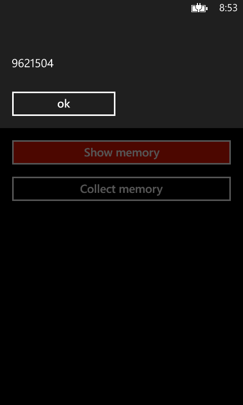
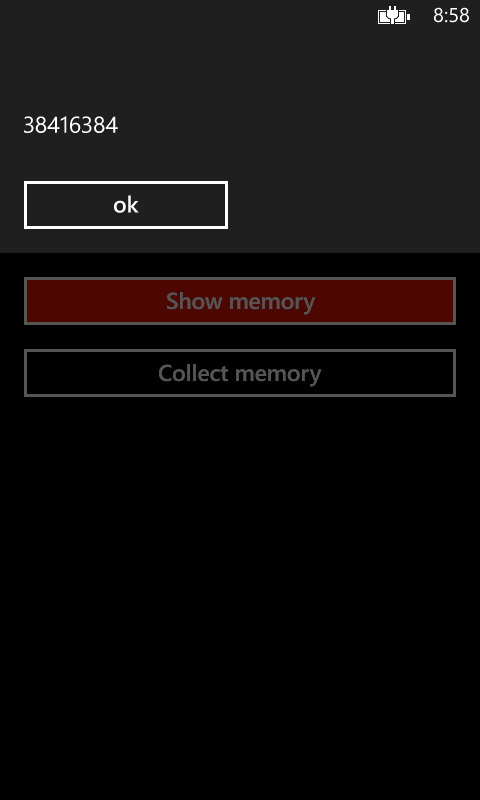
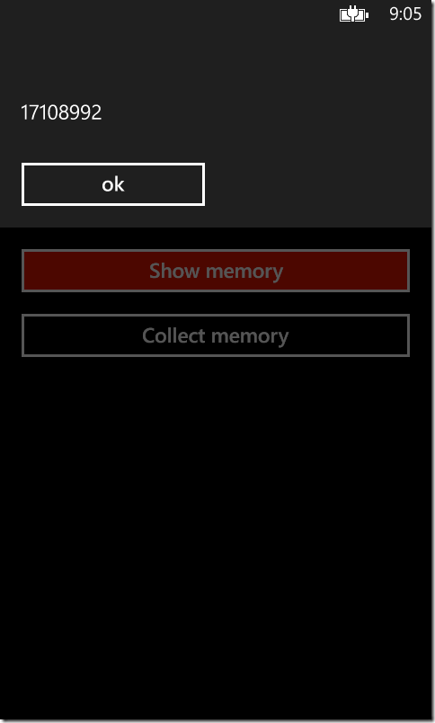
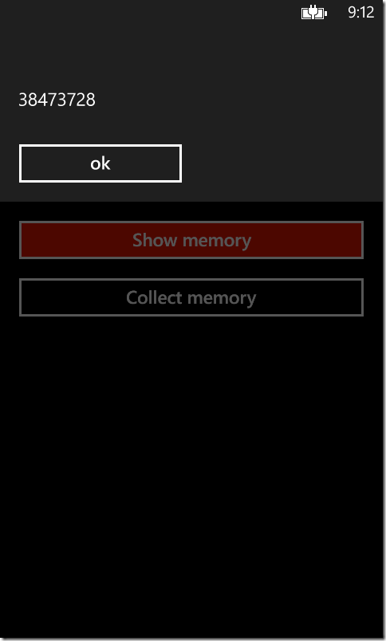

A weird behavior (one more) I noticed on Windows Phone, thanks to a question on StackOverflow (once more).

First, let’s create a simple Windows Phone application. The first page will contain three buttons: the first one navigates to another page, the second one displays the amount of memory used (by calling Microsoft.Phone.Info.DeviceStatus.ApplicationCurrentMemoryUsage), and the last one will forcefully call the garbage collector, wait for the finalizers to execute, and collect the memory freed by those finalizers:

```csharp
private void ButtonNavigate_Click(object sender, RoutedEventArgs e)
{
    this.NavigationService.Navigate(new Uri("/Page2.xaml", UriKind.Relative));
}

private void ButtonDisplayMemory_Click(object sender, RoutedEventArgs e)
{
    MessageBox.Show(Microsoft.Phone.Info.DeviceStatus.ApplicationCurrentMemoryUsage.ToString());
}

private void ButtonCollectMemory_Click(object sender, RoutedEventArgs e)
{
    GC.Collect();
    GC.WaitForPendingFinalizers();
    GC.Collect();
}
```

In the second page, we simply create a few objects and bind them to a grid. The sole purpose is to simulate a page that would use a large amount of memory:

```csharp
protected override void OnNavigatedTo(System.Windows.Navigation.NavigationEventArgs e)
{
    this.ListBox.ItemsSource = Enumerable.Range(0, 50).Select(i => new
    {
        Title = i.ToString(),
        Payload = new byte[1024 * 512]
    });
}
```

Then, the test can start. Start the application, and display the amount of used memory. The tests are done with the application compiled in release mode and no debugger attached, to simulate exactly what’ll happen on a published application:

[](http://blog.wpdev.fr/wp-content/uploads/2013/11/1.png)

 

At that point, the memory used is 9.6 MB. Just in case, we tap the “Collect Memory” button, then look again at the memory usage. A small amount is freed, and the memory usage is now 9.5 MB. Nothing surprising so far.

Then, we navigate to the second page, and back to the first one (using the back button of the phone). We expect the memory usage to jump, and indeed it does:

[](http://blog.wpdev.fr/wp-content/uploads/2013/11/2.png)

38 MB of memory used. We’ve created 50 objects, each with a payload of 512 KB, so about 25 MB, plus the memory used by the page. So far, the memory usage is coherent. Now, we try to collect the memory, and the surprises begin:

[](http://blog.wpdev.fr/wp-content/uploads/2013/11/3.png)

Still 38 MB! Almost no memory has been freed. The page isn’t in the backstack anymore, it should have been collected, and yet…

Navigating once more to page 2, then back to page 1,and displaying the memory:

[](http://blog.wpdev.fr/wp-content/uploads/2013/11/4.png)

66 MB. We now have two instances of our second page kept into memory. What will happen this time if we collect the memory ?

[](http://blog.wpdev.fr/wp-content/uploads/2013/11/5.png)

44 MB. Apparently, one of the page has been collected. What’s happening? Why haven’t the two pages been collected at the same time, since none of them are in the backstack? Why has a page been collected even though it wasn't collected the first time?

Pressing the collect button once more, and…

[](http://blog.wpdev.fr/wp-content/uploads/2013/11/6.png)

17 MB. We’re not back exactly with the same amount of memory we started (probably because some libraries has been loaded at some point), but we allocate 25 MB of memory in the second page so we can say for sure it has been freed.

Trying once more. Navigating to page 2, back to page 1, and displaying the amount of memory: 40 MB. Pressing the collect button, then displaying the amount of memory: still 40 MB. Pressing the collect button once more, then displaying the amount of memory: 17 MB. Apparently, we have to collect the memory two times for the page to be freed.

Then, can we just chain the calls to the garbage collector? Let’s change the code of the collect button to simulate what happens when we tap two times on it:

```csharp
private void ButtonCollectMemory_Click(object sender, RoutedEventArgs e)
{
    GC.Collect();
    GC.WaitForPendingFinalizers();
    GC.Collect();

    GC.Collect();
    GC.WaitForPendingFinalizers();
    GC.Collect();
}
```

Compiling the app, launching it, and displaying the amount of memory: 9.6 MB. Pressing the collect button: 9.6 MB. So far, the results are consistent with the first experience. Navigating to the second page, back to the first page, and displaying the memory: 38 MB. Pressing the collect button, and displaying the memory again:

[](http://blog.wpdev.fr/wp-content/uploads/2013/11/7.png)

Still 38 MB! Collecting again, and displaying the memory: 12 MB… Why do we still need to press the button two times even though we’re calling the garbage collector twice as much? Well, anyone who knows how the garbage collector works must have figured out that it would change nothing. Still, what happens when we press the button two times?

This time, we’re going to let the UI thread run between our two calls to the garbage collector:

```csharp
private void ButtonCollectMemory_Click(object sender, RoutedEventArgs e)
{
    GC.Collect();
    GC.WaitForPendingFinalizers();
    GC.Collect();

    this.Dispatcher.BeginInvoke(() =>
    {
        GC.Collect();
        GC.WaitForPendingFinalizers();
        GC.Collect();
    });
}
```

Then we do the test again. Initial memory: 9.6 MB. Navigating to second page and back to the first page: 38 MB. Pressing the collect button: 11.7 MB. We finally managed to free the unused memory!

## Summing it up

**What has our test showed?** After leaving a page, calling the garbage collector once isn’t enough to free the memory used. You have to call it twice, letting the UI thread between the two calls.

**What does it change?** The memory limit on Windows Phone is really tight, especially on 512 MB devices. In normal situations, you shouldn’t have to call the garbage collector yourself: you can trust it to run automatically when the memory is running low. However, we just saw that calling it once doesn’t free the memory. It means that you can’t rely on that mechanism anymore: after leaving a page that use huge amounts of memory, even if the garbage collector is triggered automatically, it won’t be able to free the memory and you may run into an OutOfMemory exception, even though those objects aren’t used anymore!

In most situations, you shouldn’t have to worry about it. But if your application tends to crash because of lack of memory, you may want to consider calling manually the garbage collector after leaving a page that allocates large amounts of memory. And don’t forget to let the UI thread run between the two calls!

Oh, but it gets even better when you try to do that in the “OnNavigatedTo” event of the first page. You don’t have to call the garbage collector once, or twice, but thrice!

```csharp
protected override void OnNavigatedTo(System.Windows.Navigation.NavigationEventArgs e)
{
    this.Dispatcher.BeginInvoke(() =>
    {
        this.Dispatcher.BeginInvoke(() =>
        {
            this.Dispatcher.BeginInvoke(() =>
            {
                GC.Collect();
                GC.WaitForPendingFinalizers();
                GC.Collect();
            });
        });
    });
}
```

And trust me, it works.
