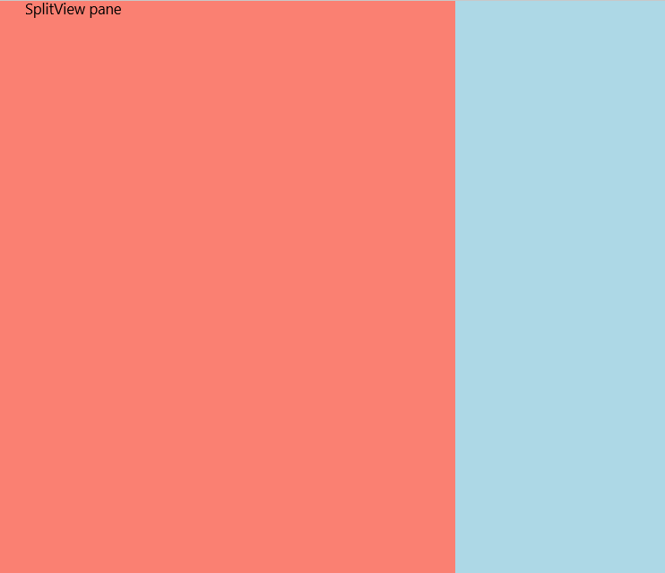

Another new addition to the Windows 10 SDK is the _SplitView_. It's used to display a side menu, such as the one usually called "hamburger menu".

It's quite straightforward to use. The "_Pane_" property contains the code of the menu itself. The page content goes into the control itself. The "_OpenPaneLength_" sets the width of the menu. Lastly, the "PanePlacement" property indicates on which side of the page the menu will appear (currently limited to left and right, top and bottom doesn't seem to be supported). The menu is opened by setting the "IsPaneOpen" property to true, and closed when the property is set to false or the user taps outside.

Wrapping it up, we get this simple implementation (also using the _RelativePanel_ shown in the previous post). I chose to use a thin clickable vertical bar on the left side rather than a button, to show the menu:

 

In the code-behind, we react to the "Tapped" event to show/collapse the menu:

Launching the app, we get this simple layout which demonstrates my prowess as designer:

Tapping on the red bar brings the menu with a smooth sliding animation (that I can't show on screenshots):

The control seems a bit limited right now, but we must keep in mind that it's still an early preview. In any case, it's a nice addition to the WinRT toolbox.
