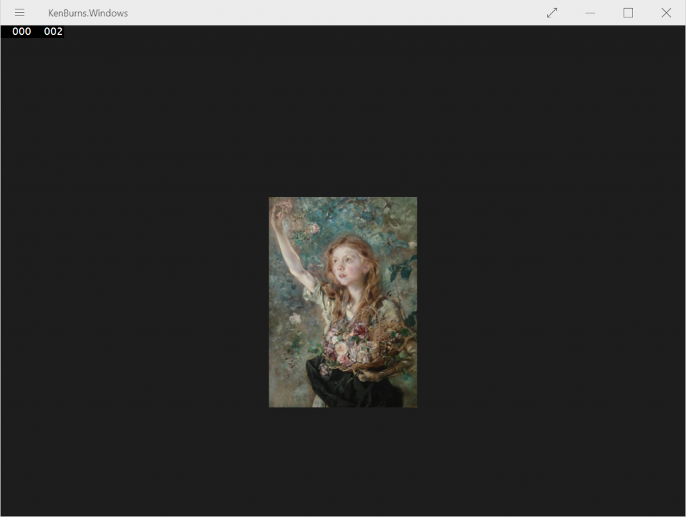
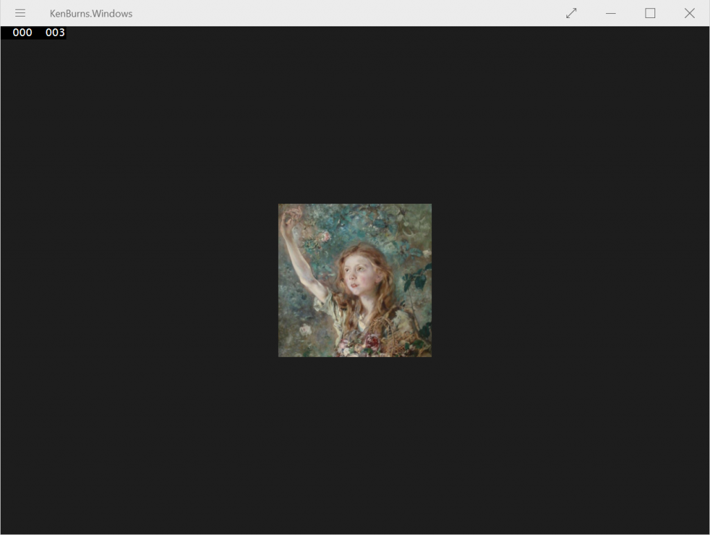

In a mobile application, we often face the challenge of fitting a large picture in a limited, fixed-size space. One of the common solutions is to generate a thumbnail, but depending on the ratio of the picture the result will not necessarily meet the quality standards. In my case, I decided to try an alternative approach and mimic the built-in effect when pinning a picture as a secondary tile on Windows Phone, where the picture slowly scrolls from top to bottom ([Ken Burns effect](http://en.wikipedia.org/wiki/Ken_Burns_effect)).

There is no control on Windows Phone to produce this kind of effect, so I had to put together my own.

First step, creating the files. For that, I chose to use a usercontrol, as the templating is far easier. Inside, we use a Canvas as container, and put the Image control inside:

```xml
<UserControl
    x:Class="KenBurns.SlidingImage2"
    xmlns="http://schemas.microsoft.com/winfx/2006/xaml/presentation"
    xmlns:x="http://schemas.microsoft.com/winfx/2006/xaml"
    xmlns:local="using:KenBurns"
    xmlns:d="http://schemas.microsoft.com/expression/blend/2008"
    xmlns:mc="http://schemas.openxmlformats.org/markup-compatibility/2006"
    mc:Ignorable="d"
    d:DesignHeight="300"
    d:DesignWidth="400"
    x:Name="Root">
    <UserControl.Resources>
        <Storyboard x:Name="SlidingStoryboard" RepeatBehavior="Forever">
            <DoubleAnimationUsingKeyFrames Storyboard.TargetProperty="(UIElement.RenderTransform).(CompositeTransform.TranslateY)" Storyboard.TargetName="Image">
            </DoubleAnimationUsingKeyFrames>
        </Storyboard>
    </UserControl.Resources>
    <Canvas>
        <Image x:Name="Image" Width="{Binding ElementName=Root, Path=ActualWidth}" Source="{Binding ElementName=Root, Path=Source}">
            <Image.RenderTransform>
                <TranslateTransform x:Name="ImageTransform" />
            </Image.RenderTransform>
        </Image>
    </Canvas>
</UserControl>
```

Nothing too fancy here. Note that I give a name to the UserControl (“Root”), to make things easier when referencing it in bindings. The “Width” property of the image is bound to the “_ActualWidth_” property of the UserControl. This way, the picture will fill the width of the container. The “_Source_” property is bound to a dependency property with the same name, declared in the code-behind of the UserControl:

```csharp
public static readonly DependencyProperty SourceProperty = DependencyProperty.Register(
    "Source", typeof(ImageSource), typeof(SlidingImage2), new PropertyMetadata(default(ImageSource), (o, args) =>
    {
        ((SlidingImage2)o).InvalidateMeasure();
    }));

public ImageSource Source
{
    get { return (ImageSource)GetValue(SourceProperty); }
    set { SetValue(SourceProperty, value); }
}
```

Finally, we create a test page for our control, and explicitly set its height and width to 200 pixels:

```xml
<Page
    x:Class="KenBurns.MainPage"
    xmlns="http://schemas.microsoft.com/winfx/2006/xaml/presentation"
    xmlns:x="http://schemas.microsoft.com/winfx/2006/xaml"
    xmlns:local="using:KenBurns"
    xmlns:d="http://schemas.microsoft.com/expression/blend/2008"
    xmlns:mc="http://schemas.openxmlformats.org/markup-compatibility/2006"
    mc:Ignorable="d">
    <Grid Background="{ThemeResource ApplicationPageBackgroundThemeBrush}">
        <StackPanel>
            <local:SlidingImage2 Source="Picture.jpg" Width="200" Height="200" />
            <TextBlock>Test</TextBlock>
        </StackPanel>
    </Grid>
</Page>
```

When starting the application, the picture is correctly displayed, but we notice right away that the height of the picture is wrong, and is bigger than the requested 200 pixels:

##  [](http://blog.wpdev.fr/wp-content/uploads/2015/03/1.png)**Clipping**

The height of the control is actually good, but per default no clipping is applied and the picture is rendered outside of its bonds. To fix this, we need to use the “_Clip_” property, to explicitly set the bounds. We want the size of the clipping zone to change according to the size of the control (to handle orientation changes), so it’s easier to set it directly from the code-behind. We subscribe to the “_SizeChanged_” event, and set the clipping to the full size of the control:

```csharp
private void OnSizeChanged(object sender, SizeChangedEventArgs e)
{
    this.Root.Clip = new RectangleGeometry { Rect = new Rect(new Point(0, 0), e.NewSize) };
}
```

When testing it, the image is clipped as expected:

[](http://blog.wpdev.fr/wp-content/uploads/2015/03/2.png)

Now all that’s left is the sliding animation.

## **The animation**

This part is trickier than it sounds. Making a sliding animation isn’t all that difficult, however we have two more constraints to take care of:

- The pictures are of variable size. When the height of the picture is smaller than the height of the control, no animation must be done
- The size of the image isn’t known at compilation time, therefore we're forced to decide whether to start the animation or not at runtime.

We start by adding a _TranslateTransform_ to the _Image_ control, then a _Storyboard_ targeting the “_Y_” property of the transform:

```xml
<Image x:Name="Image" Width="{Binding ElementName=Root, Path=ActualWidth}" Source="{Binding ElementName=Root, Path=Source}">
    <Image.RenderTransform>
        <TranslateTransform x:Name="ImageTransform" />
    </Image.RenderTransform>
</Image>
```

The speed of an animation is calculated from the duration. I want the translation effect to go at the same speed no matter the size of the picture, so the duration must be set dynamically. Therefore, we’ll create the animations directly from the code-behind. To create the animation, we write a “_SetStoryboard_” method. First, we retrieve the storyboard from the control’s resources, and we make sure it’s stopped as it may be called multiple times (we’ll elaborate on this later). If we need to stop it, we also make sure to rewind it.

```csharp
private void SetStoryboard()
{
    var storyboard = (Storyboard)this.Resources["SlidingStoryboard"];

    if (storyboard.GetCurrentState() != ClockState.Stopped)
    {
        storyboard.Stop();
        storyboard.Seek(TimeSpan.Zero);
    }
}
```

Then we make sure that the height of the picture is greater than the size of the control, in which case we populate the key frames of the animation and start the storyboard. The animation will have four phases:

- First, we display the top of the picture for three seconds
- Then we slide to the bottom, at a peak speed of 10 pixels per second, using an easing function to have an acceleration and deceleration
- We display the bottom of the picture for two seconds
- We quickly slide back up to the top of the picture in 500 milliseconds, and repeat the animation

The final method looks like:

```csharp
private void SetStoryboard()
{
    var storyboard = (Storyboard)this.Resources["SlidingStoryboard"];

    if (storyboard.GetCurrentState() != ClockState.Stopped)
    {
        storyboard.Stop();
        storyboard.Seek(TimeSpan.Zero);
    }

    var animation = (DoubleAnimationUsingKeyFrames)storyboard.Children[0];

    animation.KeyFrames.Clear();

    if (this.Image.ActualHeight > this.ActualHeight)
    {
        var scrollHeight = this.Image.ActualHeight - this.ActualHeight;

        animation.KeyFrames.Add(new EasingDoubleKeyFrame { KeyTime = TimeSpan.FromSeconds(3), Value = 0 });

        var scrollDuration = scrollHeight / 10;

        animation.KeyFrames.Add(new EasingDoubleKeyFrame
        {
            KeyTime = TimeSpan.FromSeconds(3 + scrollDuration),
            Value = -scrollHeight,
            EasingFunction = new QuadraticEase { EasingMode = EasingMode.EaseInOut }
        });

        animation.KeyFrames.Add(new EasingDoubleKeyFrame
        {
            KeyTime = TimeSpan.FromSeconds(5 + scrollDuration),
            Value = -scrollHeight
        });

        animation.KeyFrames.Add(new EasingDoubleKeyFrame
        {
            KeyTime = TimeSpan.FromSeconds(5.5 + scrollDuration),
            Value = 0,
            EasingFunction = new CubicEase { EasingMode = EasingMode.EaseOut }
        });

        storyboard.Begin();
    }
}
```

Now when to call it? First, in the “_ImageOpened_” event of the Image control, that’s the moment we’ll know the height of the picture. Since a change in the width of the picture will impact the height of the picture (to maintain the aspect ratio), we must also change the timing of the animation in the “_SizeChanged_” event.

```csharp
private void OnSizeChanged(object sender, SizeChangedEventArgs e)
{
    this.Root.Clip = new RectangleGeometry { Rect = new Rect(new Point(0, 0), e.NewSize) };
    this.SetStoryboard();
}

private void OnImageOpened(object sender, RoutedEventArgs e)
{
    this.SetStoryboard();
}
```

At this point, we have a working animation:

\[video width="840" height="944" mp4="http://blog.wpdev.fr/wp-content/uploads/2015/03/ScreenCapture\_3-27-2015\_7.mp4"\]\[/video\]

## **Automatic height**

Last but not least, what happens if I want the height to be set automatically? For instance, I want my control to use 200 pixels on the screen. If the picture is bigger, only 200 pixels should be displayed, and the animation is used to show the hidden parts of the picture. If the picture is smaller, the control is resized to fit it.

The perfect candidate is the “_MaxHeight_” property. Let’s change our test page to set the maximum height of the control, and display some text underneath to test the bounds:

```xml
<StackPanel>
    <local:SlidingImage2 Source="Picture.jpg" MaxHeight="200" />
    <TextBlock>Test</TextBlock>
</StackPanel>
```

When testing it, the image disappears completely. Why?

[](http://blog.wpdev.fr/wp-content/uploads/2015/03/3.png)

The problem is: we’ve set no default height and the control has no logic to resize itself. To fix this, we need to override the “_MeasureOverride_” method. It is called by the parent container (in our test page, the _StackPanel_) to tell the control how much space is available, and the control must answer with the amount of space it would like to use. In our case, we’ll fill all the width. For the height, we’ll take the minimum between the height of the picture and the available height:

```csharp
protected override Size MeasureOverride(Size availableSize)
{
    var height = this.Source == null ? 0 : Math.Min(this.Image.ActualHeight, availableSize.Height);

    return new Size(availableSize.Width, height);
}
```

Now, since the picture’s size is only known after loading, we need to manually call the “_InvalidateMeasure_” method. It'll tell the container that the control’s size should be re-computed. We call it at two places:

- In the “_ImageOpened_” event, since that’s the moment when we know the size of the picture
- When the “_Source_” dependency property is set, to reset the size of the control if the source (and therefore, the displayed picture) is changed at some point

The final code looks like:

```csharp
public static readonly DependencyProperty SourceProperty = DependencyProperty.Register(
    "Source", typeof(ImageSource), typeof(SlidingImage2), new PropertyMetadata(default(ImageSource), (o, args) =>
    {
        ((SlidingImage2)o).InvalidateMeasure();
        ((SlidingImage2)o).SetStoryboard();
    }));

public ImageSource Source
{
    get { return (ImageSource)GetValue(SourceProperty); }
    set { SetValue(SourceProperty, value); }
}
```
