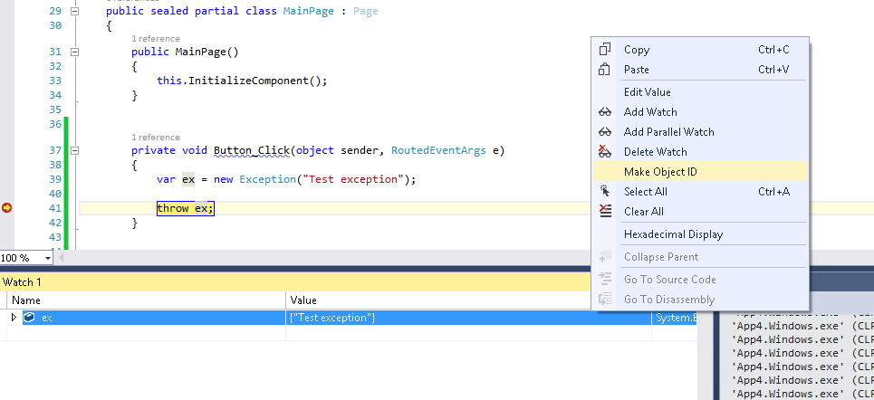
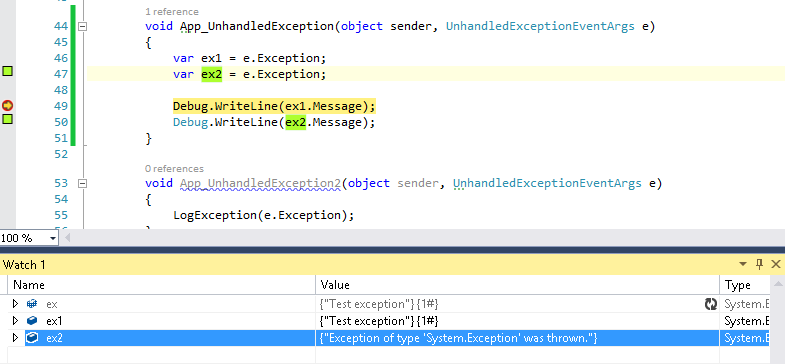

That's a surprising behavior, brought to my attention by [this question of Anthony Wieser](https://social.msdn.microsoft.com/Forums/windowsapps/en-US/17833b4b-b69d-43f0-93f2-213c8c7bc8bb/why-does-exceptionstacktrace-disappear?forum=winappswithcsharp) on MSDN forums. Basically, he noticed that in the global exception handler, he could read the stacktrace of the exception only once. On the subsequent tries, the value would be null.

# The debugging part

We'll start by making a simple program to reproduce the issue. When the user click on a button, we throw a custom exception:

```csharp
private void Button_Click(object sender, RoutedEventArgs e)
{
    throw new Exception("Test exception");
}
```

In the App.xaml.cs file, we subscribe to the unhandled exception handler, and print twice the stacktrace of the exception: 

```csharp
public App()
{
    this.InitializeComponent();
    this.Suspending += this.OnSuspending;
    this.UnhandledException += App_UnhandledException;
}

void App_UnhandledException(object sender, UnhandledExceptionEventArgs e)
{
    Debug.WriteLine(e.Exception.StackTrace);
    Debug.WriteLine(e.Exception.StackTrace);
}
```

Sure enough, the stacktrace is printed only once. The second time, the property is null. What's going on?

Fiddling with the debugger a bit, I noticed that the stacktrace wasn't the only property to change: the message was first _"Test Exception"_, as expected from the test case, but on second try it was changed to a more generic message: _"Exception of type 'System.Exception' was thrown"_. From there, I got a hunch that the exception wasn't losing its contextual information, but rather that we were dealing with another exception altogether.

To test this hypothesis, I started to change my test code to assign the exception to a variable before throwing it: 

```csharp
private void Button_Click(object sender, RoutedEventArgs e)
{
    var ex = new Exception("Test exception");

    throw ex;
}
```

In the unhandled exception handler, I assign the contents of the _e.Exception_ property to two different variables, then display their message:  

```csharp
void App_UnhandledException(object sender, UnhandledExceptionEventArgs e)
{
    var ex1 = e.Exception;
    var ex2 = e.Exception;

    Debug.WriteLine(ex1.Message);
    Debug.WriteLine(ex2.Message);
}
```

From there, I put a breakpoint on the line throwing the exception, add the "'ex" variable in the "Watch" panel of Visual Studio, right click, and select "Make Object ID":

[](http://blog.wpdev.fr/wp-content/uploads/2015/04/1.png) This tells the debugger to track internally the reference, even if it's not reachable from the code anymore.

When the unhandled exception handler is reached, after assigning both "ex1" and "ex2", I add them as well to the Watch panel:

[](http://blog.wpdev.fr/wp-content/uploads/2015/04/2.png)

What we see here is that "ex1" contains a reference to the exact same exception that was thrown (identified by the object ID '1#'). The second one is a totally different exception.

Another test is to check the result of the code "e.Exception == e.Exception". It returns _False_, showing that accessing the _Exception_ property of the _UnhandledExceptionEventArgs_ object creates a new exception every time.

# Analysis and conclusion

The question that immediately comes to mind is: can this be considered as a bug?

To my surprise, [the documentation on MSDN](https://msdn.microsoft.com/en-us/library/windows/apps/windows.ui.xaml.application.unhandledexception) actually hints to this behavior:

> The UnhandledException event arguments expose an exception object through the Exception property. **However, the type, message, and stack trace of this exception object are not guaranteed to match those of the original exception that was raised.** The event arguments do expose a Message property. **In most cases**, this will contain the message of the originally raised exception.

So if it's documented, and as such it can be considered as a questionable feature rather than a bug. Still, I can't think of any good reason why the _UnhandledExceptionEventArgs_ object wouldn't cache the exception object after properly retrieving it the first time. Especially given how dangerous this behavior is:

In most case, you can manage to access the _Exception_ property only once, store the object in a variable, and use it to your leisure for further inspection. However, what happens if you have multiple unhandled exception handlers? For instance, if you're using a logging framework as well as a custom handler? Only the first handler will get a chance to inspect the original exception, while the subsequent handlers will only see a stripped down version of the object.

An event where all subscribers don't get the same information is counter-intuitive, and can only be considered as poor design. Will this get fixed in a future version of WinRT?
