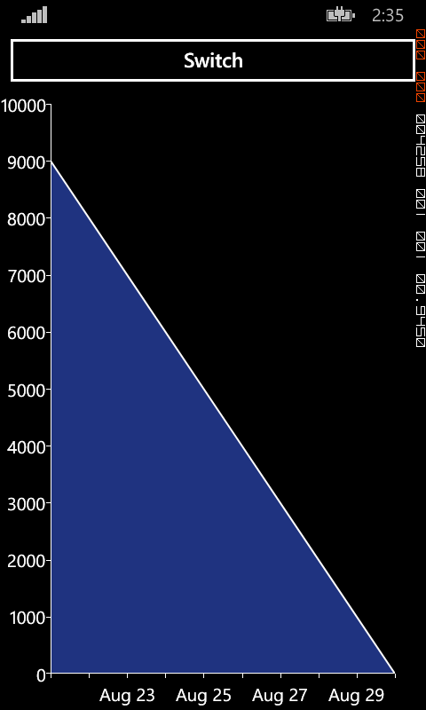
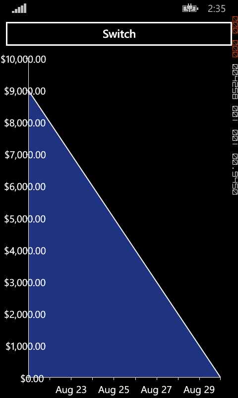
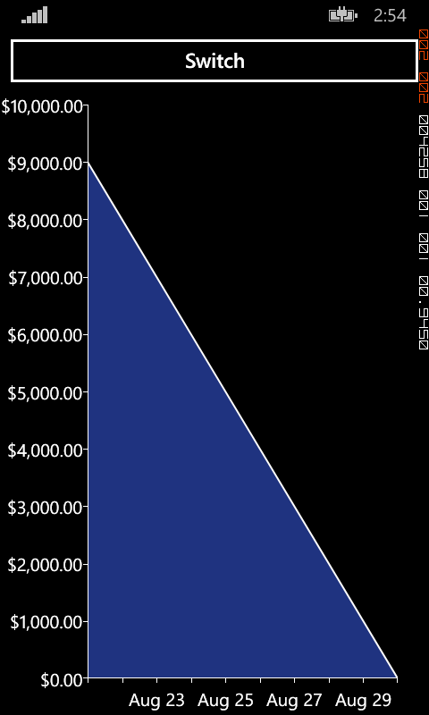

This is a strange corner-case in the way Telerik's RadCartesianChart control handles the placement of labels. There is very little chance that you ever meet this bug, but if you do it can be quite unsettling, and that's why I chose to cover it in this post.

# The setup

First, what is this bug about? Let's start by displaying a simple chart. The only twist here is that I use a converter to display the labels, because I want the user to be able to change the format dynamically:

```xml
<phone:PhoneApplicationPage
    x:Class="LabelPlacementIssue.MainPage"
    xmlns="http://schemas.microsoft.com/winfx/2006/xaml/presentation"
    xmlns:x="http://schemas.microsoft.com/winfx/2006/xaml"
    xmlns:phone="clr-namespace:Microsoft.Phone.Controls;assembly=Microsoft.Phone"
    xmlns:shell="clr-namespace:Microsoft.Phone.Shell;assembly=Microsoft.Phone"
    xmlns:d="http://schemas.microsoft.com/expression/blend/2008"
    xmlns:mc="http://schemas.openxmlformats.org/markup-compatibility/2006"
    xmlns:telerikChart="clr-namespace:Telerik.Windows.Controls;assembly=Telerik.Windows.Controls.Chart"
    FontFamily="{StaticResource PhoneFontFamilyNormal}"
    FontSize="{StaticResource PhoneFontSizeNormal}"
    Foreground="{StaticResource PhoneForegroundBrush}"
    SupportedOrientations="Portrait"  Orientation="Portrait"
    mc:Ignorable="d" d:DesignHeight="768" d:DesignWidth="480"
    shell:SystemTray.IsVisible="True">
    <phone:PhoneApplicationPage.Resources>
        <local:StringFormatConverter x:Key="LabelsFormat" Format="{}{0}" />
    </phone:PhoneApplicationPage.Resources>
    <Grid x:Name="LayoutRoot" Background="Transparent">
        <Grid.RowDefinitions>
            <RowDefinition Height="Auto"/>
            <RowDefinition Height="*"/>
        </Grid.RowDefinitions>
        <Button Content="Switch" Click="ButtonSwitchClick" />
        <telerikChart:RadCartesianChart x:Name="Chart" Grid.Row="1">
            <telerikChart:RadCartesianChart.HorizontalAxis>
                <telerikChart:DateTimeContinuousAxis LabelFormat="MMM dd" />
            </telerikChart:RadCartesianChart.HorizontalAxis>
            <telerikChart:RadCartesianChart.VerticalAxis>
                <telerikChart:LinearAxis LabelInterval="2">
                    <telerikChart:LinearAxis.LabelTemplate>
                        <DataTemplate>
                            <TextBlock Text="{Binding Converter={StaticResource LabelsFormat}}" />
                        </DataTemplate>
                    </telerikChart:LinearAxis.LabelTemplate>
                </telerikChart:LinearAxis>
            </telerikChart:RadCartesianChart.VerticalAxis>
            <telerikChart:AreaSeries x:Name="Series" LabelOffset="2" />
        </telerikChart:RadCartesianChart>
    </Grid>
</phone:PhoneApplicationPage>
```

Nothing fancy in the converter: it parses the input if it's numeric, then calls _string.Format_ with the desired format.

```csharp
public class StringFormatConverter : IValueConverter
{
    public string Format { get; set; }

    public object Convert(object value, Type targetType, object parameter, CultureInfo culture)
    {
        var valueAsString = value as string;

        if (valueAsString != null)
        {
            double d;

            if (double.TryParse(valueAsString, out d))
            {
                value = d;
            }
        }

        return string.Format(this.Format ?? "{0}", value);
    }

    public object ConvertBack(object value, Type targetType, object parameter, CultureInfo culture)
    {
        throw new NotImplementedException();
    }
}
```

Last piece of the puzzle, in the code-behind we have a _FillChart_  method that clears the chart and generates a few points. We start by calling it once at startup. Then, when the user clicks on the "switch" button, we change the format of the converter and call _FillChart_ again.

```csharp
public partial class MainPage : PhoneApplicationPage
{
    public MainPage()
    {
        InitializeComponent();

        this.Loaded += (s, e) => this.FillChart();
    }

    private void FillChart()
    {
        this.Series.DataPoints.Clear();

        for (int i = 0; i < 10; i++)
        {
            this.Series.DataPoints.Add(new CategoricalDataPoint
            {
                Category = DateTime.Now.AddDays(-i),
                Value = i
            });
        }
    }

    private void ButtonSwitchClick(object sender, RoutedEventArgs e)
    {
        var converter = (StringFormatConverter)this.Resources["LabelsFormat"];
        converter.Format = "{0:C2}";
        this.FillChart();
    }
}
```

Launching the app, the chart and labels are displayed as expected:

[](http://blog.wpdev.fr/wp-content/uploads/2015/08/1.png)    

 

Then we press the "switch" button, and the labels now overlap with the chart area:

    [](http://blog.wpdev.fr/wp-content/uploads/2015/08/2.png)     What happened?  

# Digging in

The first thing to notice here is that the width allocated to the labels doesn't change after pressing the "switch" button. It seems that the control doesn't recompute the size required by the labels. With that in mind, I started exploring the source code of the control (no need for a disassembler this time, Telerik provides the source of all the controls). Unfortunately, I don't know how permissive the Telerik license is, so I won't be able to show the relevant portions of code. Suffice to say that the control internally uses a dictionary to cache the size of the labels, to avoid computing it every time. The key of the dictionary is the text to be displayed in the label, and the value is the resulting size. In our case, the size is correctly computed the first time. Then, when pressing the "switch" button, we change the format of the converter (and therefore, the size of the resulting labels) without changing the value itself. This results in the observed wrong placement.

# The fix

At this point, all we need to do is clearing the cache, right? So I thought. Unfortunately, the cache is completely sealed, no public or protected way to access it is provided. I wish developers made a more extensive usage of the _protected_ keyword to provide as many extensions points as possible in their APIs, but that's a different debate. So, what can we do here? I searched the code paths that result in the cache being cleared, and finally found one that feels really hackish but is easy enough to use: the _LabelRotationAngle_ property of the axis. When changed, the size of all the labels is recomputed to accommodate with the new angle. All we need to do is to increment it, then immediately revert it back to its old value:

```csharp
private void ButtonSwitchClick(object sender, RoutedEventArgs e)
{
    var converter = (StringFormatConverter)this.Resources["LabelsFormat"];
    converter.Format = "{0:C2}";
    this.Chart.VerticalAxis.LabelRotationAngle++;
    this.Chart.VerticalAxis.LabelRotationAngle--;
    this.FillChart();
}
```

Now, after clicking the "switch" button, the labels are correctly placed:

[](http://blog.wpdev.fr/wp-content/uploads/2015/08/3.png)
