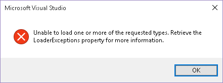
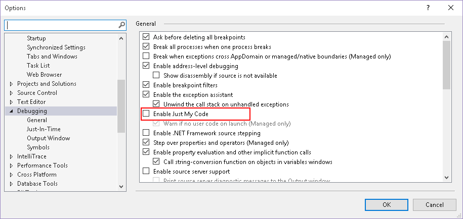
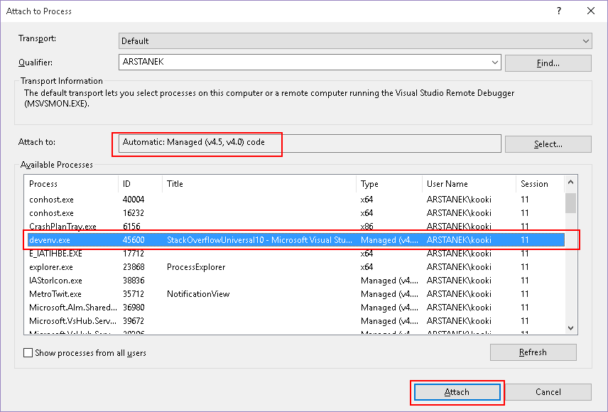
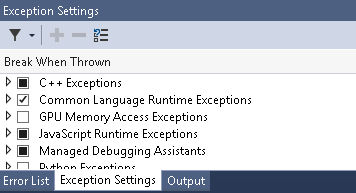

When used to install various extensions and beta SDKs on your development machine, it often occurs that Visual Studio starts acting erratically, even to the point of stopping working. Sometimes, the workaround can be easily found by browsing through specialized websites, sometimes it can be much harder because you're lacking information on the precise issue. That's when trying to debug your IDE can help putting you in the right direction. I encountered such situation today, so I thought it would be interesting to share the few steps I had to go through.

# The symptoms

It all started when trying to create my first Windows 10 project on this computer. Even though the project was freshly created, without a single change, deployment to the Windows Phone emulator failed without any helpful error message. Digging further, I noticed that I couldn't edit the _package.appxmanifest_ file, an error dialog appearing every time I tried to open the file in Visual Studio:

The trained eye will recognize a _ReflectionTypeLoadException_, unfortunately the error dialog doesn't show enough information to figure out what assembly failed to load. That's the moment when I decided to fire up the debugger to gather more information.

# Debugging the debugger?

It seems counter-intuitive at first, but many components in Visual Studio have been written in .NET, and can therefore be debugged like any other .NET application... by using another instance of Visual Studio.

The first step is to prepare your IDE. Since we'll be debugging external code, you must make sure to disable "Just my code" in the options (Tools -> Options -> Debugging -> Uncheck the "Enable Just My Code" checkbox). Enabling the automatic load of symbols can also help, at the expense of a painfully long loading time when attaching a process.

With that taken care of, all is left is attaching your second instance of Visual Studio to the first one. Open the "Debug_"_ menu, and click on "Attach to process". Search the process corresponding to the first instance of Visual Studio, make sure the "Attach to" setting is set to "Automatic", and click on the "Attach" button.

After a few seconds to a few minutes (depending on whether automatic symbols loading is turned on), you'll be able to start debugging. Since at this point we're not sure of what exception will be thrown, make sure that Visual Studio is configured to catch all types of managed exceptions: go in "Debug -> Windows -> Exception Settings" to open the exceptions panel (or press control + alt + e), and check the "Common Language Runtime Exceptions" box.

Now, go back to the first Visual Studio, and reproduce the error (in my case, I just had to try to open the _package.appxmanifest_ file). Unfortunately at that point I was too absorbed in what I was doing and I forgot to make screenshots... But at some point Visual Studio should break on the exception. When it does, you can go in the "Locals" panel to inspect the exception, or open a quickwatch dialog (shift + F9) and type "$exception". This way, I was able to confirm that a _ReflectionTypeLoadException_ was thrown, and to get the details in the _LoaderExceptions_ property:

> Could not load file or assembly 'Microsoft.JavaScript.Services, Version=14.0.0.0, Culture=neutral, PublicKeyToken=b03f5f7f11d50a3a' or one of its dependencies. The system cannot find the file specified.":"Microsoft.JavaScript.Services, Version=14.0.0.0, Culture=neutral, PublicKeyToken=b03f5f7f11d50a3a

# The solution

With the name of the assembly in hand, and some Google-fu, I was able to find [this thread in the MSDN forums](https://social.msdn.microsoft.com/Forums/en-US/147cd1a2-1f1a-4847-a256-0613cfea732d/rtm-known-issue-visual-studio-hangs-when-creating-a-new-cordova-project-or-intellisense-doesnt?forum=Win10SDKToolsIssues). Basically, something went wrong with the installation of Apache Cordova, and repairing the installation of the "Tools for Universal Windows App Development" component in Visual Studio fixed the issue.
