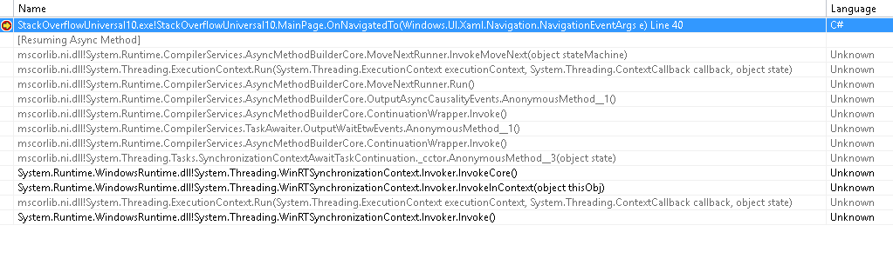
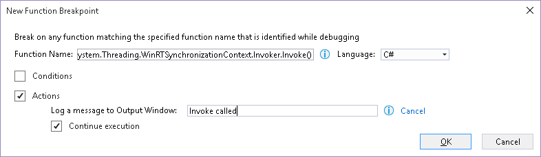

I came to write a code looking like this: 

Then I stepped back a bit and thought: _OnNavigatedTo_ is an event, and its return type can't be changed from _void._ Therefore, is there a point in awaiting the last asynchronous call of the method, as this will provide no information at all to the caller? Would it result in a useless call to the dispatcher, just to execute an empty callback? Actually, is the compiler smart enough to detect this case and remove the seemingly useless _await_?

# Understanding what's going on

How to figure out whether the last _await_ call has any impact? Let's say I add some code at the end of the method:  

Then of course the dispatcher will be used after _DoSomethingAsync_ has finished executing, to switch back to the UI thread and execute the _Debug.WriteLine_ statement. But if I put nothing, how to know if the dispatcher still switches to the UI thread?

To figure it out, I've started by putting a breakpoint on the _Debug.WriteLine("next")_ method. Inspecting the callstack, we can see that it starts with _System.Threading.WinRTSynchronizationContext.Invoker.Invoke_:

To be be notified whenever this method is called, we'll insert a tracepoint, a special kind of breakpoint that displays a message in the console rather than stopping the execution flow. To do that, simply open the Breakpoints panel (_Debug -> Windows -> Breakpoints_), click on _New_, then _Function Breakpoint_. Type the full name of the method in the _Function Name_ field, check the _Actions_ box, and type the message you want to be displayed (here: "Invoke called").

 

From there, all we have to do is to execute the application and check what is displayed in the Output panel.

Note that, for some reason, Visual Studio kept removing this tracepoint between each execution (probably because it's set on external code). Make sure to re-enable it every time in the Breakpoints panel.

When testing the previous code, the following content is displayed in the Output panel:

> Doing something Invoke called next

So far, nothing surprising. _Invoke_ is called at the end of the task, to resume the execution and display the message "next".

Now, what if we put nothing after _await_? The method will look like this: 

The result in the Output panel is:

> Doing something Invoke called

It seems that the dispatcher really switched back to the UI thread, even though there is no code left in the method. As an extra precaution, I've also tested the case without _await_:

This time, invoke isn't called, as expected. Sounds like we found a cheap optimization. So cheap that I started wondering why the compiler wasn't already applying it...

# The catch (literally)

What happens when things go wrong in the task? To find out, I changed the code to throw an exception:

Here, the behavior changes drastically depending on whether we use the _await_ keyword or not. If using it, then the application crashes. If not, then nothing happens. Why?

In the first case, the exception is marshaled to the UI thread, which has been designed to crash the application whenever an exception is unhandled. In the second case, the exception is thrown in a background thread and silently ignored (actually, [this is new to .NET 4.5](http://blogs.msdn.com/b/pfxteam/archive/2011/09/28/task-exception-handling-in-net-4-5.aspx). In previous versions of the framework, this would crash the application as well). Removing _await_ will save a call to the dispatcher, but will change the thread in which the exception is observed. The optimization isn't so cheap after all...
